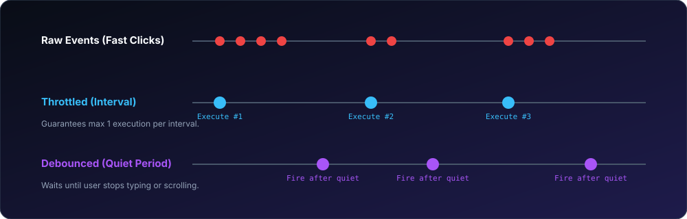

# Throttle & Debounce for Swift ⏱️

A thread-safe, zero-dependency Swift package providing **Throttle** and **Debounce** rate-limiters for GCD dispatch queues and modern Swift Concurrency (`AsyncThrottler`, `AsyncDebouncer`).

[](https://swift.org)
[](https://developer.apple.com)
[](https://swift.org/package-manager/)
[](LICENSE)

<p align="center">
  
</p>

---

## ⚡ Throttle vs. Debounce: When to Use What?

| Strategy | Behavior | Typical Use Cases |
| :--- | :--- | :--- |
| **Throttle** | Limits execution to at most **once per interval**. Guarantees periodic execution during continuous triggers. | • Window resize events<br>• Scroll position tracking<br>• Game loops & sensor updates |
| **Debounce** | Postpones execution until a **quiet period** has elapsed without new triggers. Captures final user state. | • Search text fields (as-you-type autocomplete)<br>• Auto-saving drafts<br>• Double-click debounce |

---

## 🚀 Installation

Add **ThrottleDebounce** to your dependencies in `Package.swift`:

```swift
dependencies: [
    .package(url: "https://github.com/nilkanthdesai76/swift-throttle-debounce.git", from: "1.0.0")
]
```

---

## 💻 Quick Start

### 1. Classic Throttle (GCD)

```swift
import ThrottleDebounce

let throttledScroll = throttle(milliseconds: 250, queue: .main) {
    print("Recalculating layout...")
}

// Even if called 60 times a second, fires at most once every 250ms
throttledScroll()
```

### 2. Classic Debounce (GCD)

```swift
import ThrottleDebounce

let debouncedSearch = debounce(milliseconds: 400, queue: .main) {
    print("Sending API search request...")
}

// User types: "s", "sw", "swi", "swift"
// Only fires 400ms after the user stops typing
debouncedSearch()
```

### 3. Modern Swift Concurrency (`AsyncThrottler`)

```swift
import ThrottleDebounce

let throttler = AsyncThrottler(interval: 1.0)

Task {
    // Only runs if 1 second has elapsed since previous execution
    let result = try await throttler.execute {
        try await fetchLiveMetrics()
    }
}
```

### 4. Modern Swift Concurrency (`AsyncDebouncer`)

```swift
import ThrottleDebounce

let debouncer = AsyncDebouncer(delay: 0.5)

// Submits async task; automatically cancels previous pending task
await debouncer.submit {
    await saveDocumentToCloud()
}
```

---

## 🧪 Testing

Run test suite via Swift CLI:

```sh
swift test
```

---

## 📄 License

This project is licensed under the MIT License - see the [LICENSE](LICENSE) file for details.
